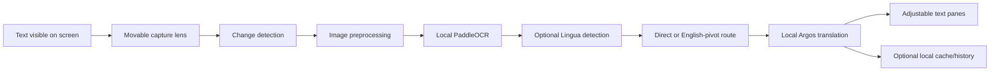

<p align="center">
  
</p>

<h1 align="center">BeeTales Translator Lens</h1>

<p align="center">
  A private Windows screen lens for recognizing and translating text with local AI models.
</p>

<p align="center">
  <a href="https://github.com/Sorairei/BeeTales-Translator-Lens/releases"><strong>Download the latest release</strong></a>
  ·
  <a href="https://github.com/Sorairei/BeeTales-Translator-Lens/issues">Report an issue</a>
  ·
  <a href="https://github.com/sponsors/Sorairei">Sponsor the project</a>
</p>

<p align="center">
  
  
  
  <a href="LICENSE"></a>
  <a href="https://github.com/sponsors/Sorairei"></a>
</p>

## Overview

BeeTales Translator Lens places a movable capture region over chats, games, documents, subtitles, and applications that do not provide selectable text. It recognizes the visible text with PaddleOCR and translates it with Argos Translate without sending captured images to a translation service.

The application is designed around local processing and explicit consent. Network access is required only when the user approves the initial download of an OCR or translation model. Once the required models are installed, recognition and translation run locally and can work offline.

Version **0.6.3** fixes grayscale screen-capture OCR, replaces the scrolling control panel with one resizable window, adds adjustable detected-text and translation panes, provides a complete in-app guide, and prevents verbose third-party diagnostics from repeating recognized text in BeeTales logs.

## Contents

- [Highlights](#highlights)
- [Supported languages](#supported-languages)
- [How it works](#how-it-works)
- [Getting started](#getting-started)
- [Using the lens](#using-the-lens)
- [Models and offline use](#models-and-offline-use)
- [Data and privacy](#data-and-privacy)
- [Performance](#performance)
- [Global shortcuts](#global-shortcuts)
- [Architecture](#architecture)
- [Quality and release verification](#quality-and-release-verification)
- [Limitations](#limitations)
- [Contributing](#contributing)
- [Sponsorship](#sponsorship)
- [License](#license)

## Highlights

| Area | Capabilities |
| --- | --- |
| Screen lens | Transparent, always-on-top, movable, resizable, lockable, and capture-excluded where Windows supports it |
| OCR | Local PaddleOCR 3.x pipelines, Unicode text, confidence values, reusable language models, and preprocessing profiles |
| Translation | Local Argos Translate routes with direct translation or a private English pivot |
| Language detection | Local Lingua detection restricted to the supported language set |
| Continuous reading | Configurable intervals, change detection, forced reads, busy-cycle protection, pause, and manual mode |
| Interface | English UI, adjustable text panes, resizable single-window controls, dark/light themes, system tray, and in-app instructions |
| Productivity | Copy original/translation, swap languages, capture preview, click-through, translation cache, and global shortcuts |
| History | Optional local history with search, copy, deletion, clearing, TXT export, and JSON export |
| Models | Consent-based downloads, installed-model management, route installation, and package removal |
| Privacy | No telemetry, no saved screenshots, memory-only text by default, and filtered operational logging |
| Distribution | Portable Windows `onedir` package, embedded product icon, version metadata, SHA-256 checksum, and bundled MiniSBD models |

## Supported languages

| Language | Source OCR | Target translation | Automatic detection |
| --- | :---: | :---: | :---: |
| English | Yes | Yes | Yes |
| Spanish | Yes | Yes | Yes |
| Polish | Yes | Yes | Yes |
| Portuguese | Yes | Yes | Yes |
| Japanese | Yes | Yes | Yes |

Manual source selection is recommended for short chat messages because it selects the correct OCR recognition model immediately. Automatic mode is useful when the source language is unknown, but requires enough readable text for reliable detection.

## How it works



Only one processing cycle can run at a time. If OCR or translation takes longer than the configured capture interval, later timer ticks are skipped instead of being queued. Static frames are ignored until the image changes or the user requests a forced read.

## Getting started

### Portable Windows release

1. Download `BeeTales-Translator-Lens-0.6.3-Windows-x64.zip` and its `.sha256` file from [GitHub Releases](https://github.com/Sorairei/BeeTales-Translator-Lens/releases).
2. Optionally verify the archive in PowerShell:

   ```powershell
   Get-FileHash .\BeeTales-Translator-Lens-0.6.3-Windows-x64.zip -Algorithm SHA256
   ```

3. Extract the complete ZIP to a writable folder.
4. Run `BeeTalesTranslatorLens.exe` inside the extracted `BeeTales Translator Lens` folder.

Keep the executable beside its `_internal` folder. BeeTales is portable as a folder, not as a single EXE. The current build is unsigned, so Windows SmartScreen may request confirmation. Administrator privileges are not required.

See [DISTRIBUTION.md](DISTRIBUTION.md) for package verification, offline behavior, and build instructions.

### Run from source

Python 3.11–3.13 and 64-bit Windows 10 or Windows 11 are supported.

```powershell
git clone https://github.com/Sorairei/BeeTales-Translator-Lens.git
cd BeeTales-Translator-Lens
.\scripts\create_venv.ps1
.\.venv\Scripts\python.exe main.py
```

Manual environment setup is also available:

```powershell
python -m venv .venv
.\.venv\Scripts\python.exe -m pip install -r requirements.txt
.\.venv\Scripts\python.exe main.py
```

## Using the lens

1. Move and resize the green lens so it covers only the text to recognize.
2. Choose the source and target languages.
3. Leave **Image preprocessing** on **Automatic** for most applications.
4. Start with a **2000 ms** capture interval for responsive operation with moderate CPU use.
5. Click **Start** and approve required model downloads when prompted.
6. Drag the divider between **Detected text** and **Translation** to resize either pane.
7. Drag the lower-right corner to resize the complete control window.
8. Open **How to use** for the complete built-in guide and troubleshooting instructions.

| Control | Purpose |
| --- | --- |
| Start / Force read | Starts continuous scanning or immediately reads the current lens contents |
| Pause | Stops new cycles without closing the application |
| Copy / Copy original | Copies translated or recognized text to the clipboard |
| Swap | Exchanges explicit source and target languages |
| Lock lens | Prevents accidental lens movement or resizing |
| Capture preview | Shows the processed image and diagnostic performance metrics |
| Click-through | Sends mouse input through the lens to the application underneath |
| Models | Installs, inspects, or removes local Argos translation packages |

## Models and offline use

BeeTales deliberately keeps large and language-specific models outside the portable ZIP.

| Component | Purpose | Download behavior |
| --- | --- | --- |
| PaddleOCR / PaddleX | Screen-text detection and recognition | Downloaded per OCR language on first use after confirmation |
| Argos Translate | Local translation | Downloaded per language direction or pivot route after confirmation |
| Lingua | Language detection | Included with the application runtime |
| MiniSBD | Local sentence splitting | Bundled for all supported languages |

For example, Polish to Spanish may use the fully local route `Polish → English → Spanish` when a direct model is unavailable. Translation directions are separate packages, so `English → Spanish` and `Spanish → English` are not interchangeable.

Downloaded models remain under the current Windows user profile and can be managed from the **Models** dialog.

## Data and privacy

| Data | Default behavior | Stored locally? | Sent to a translation service? |
| --- | --- | :---: | :---: |
| Screen captures | Processed in memory and discarded | No | No |
| Recognized text | Kept in memory | No | No |
| Translated text | Kept in memory | No | No |
| Translation history | Disabled until explicitly enabled | Optional | No |
| Persistent cache | Disabled and requires history to be enabled | Optional | No |
| Settings | Saved for the current Windows user | Yes | No |
| OCR/translation models | Installed after explicit confirmation | Yes | Download only |
| Operational logs | Errors and application state without captured text | Yes | No |

BeeTales contains no telemetry, analytics, advertising, account system, cloud synchronization, or remote text-processing API. Verbose third-party diagnostic records are filtered before they reach the application log because some inference libraries may repeat their input internally.

Application data is stored under:

```text
%LOCALAPPDATA%\BeeTales\BeeTales Translator Lens\
|-- config\
|-- models\
|-- cache\
|-- history\
|-- logs\
`-- debug\
```

**Clear saved data** removes saved translation history and the persistent translation cache. Removing the portable application folder does not automatically remove per-user models or settings.

## Performance

The first recognition or translation for a language is slower because BeeTales must initialize local models and load them into memory. Later cycles reuse the same pipelines and translation cache.

For typical chats and documents:

- Use a **1500–2000 ms** capture interval.
- Keep the lens close to the useful text instead of covering the whole screen.
- Use **Small text** preprocessing for compact chat fonts.
- Select the source language manually when messages are short.
- Use **Force read** after moving the lens or changing preprocessing settings.

The optional capture preview displays capture, preprocessing, OCR, total cycle, confidence, cache-hit, and skipped-busy-tick metrics without saving the image.

## Global shortcuts

| Shortcut | Default action |
| --- | --- |
| `Ctrl+Shift+T` | Show or hide BeeTales |
| `Ctrl+Shift+P` | Pause or resume scanning |
| `Ctrl+Shift+C` | Copy the current translation |
| `Ctrl+Shift+L` | Lock or unlock the lens |
| `Ctrl+Shift+R` | Force an immediate read |
| `Ctrl+Shift+X` | Toggle lens click-through |

Shortcuts can be changed or disabled in **Settings**. The system tray provides an additional recovery path when the windows are hidden or click-through is active.

## Architecture

| Path | Responsibility |
| --- | --- |
| `beetales_translator_lens/capture/` | Regional capture, geometry, change detection, and preprocessing |
| `beetales_translator_lens/ocr/` | PaddleOCR lifecycle, input normalization, result parsing, and OCR models |
| `beetales_translator_lens/translation/` | Language detection, normalization, routes, Argos models, and caching |
| `beetales_translator_lens/storage/` | Settings, history, cache, local paths, and privacy-filtered logging |
| `beetales_translator_lens/platform/` | Windows DPI, capture exclusion, taskbar identity, and global shortcuts |
| `beetales_translator_lens/ui/` | Lens, control panel, adjustable text panes, dialogs, guide, and themes |
| `beetales_translator_lens/workers/` | Background capture, OCR, translation, model download, and persistence tasks |
| `tests/` | Automated behavioral, storage, OCR, translation, privacy, and UI checks |
| `packaging/` | PyInstaller specification, Windows icon, and executable metadata |
| `scripts/` | Reproducible virtual-environment and Windows release commands |

### Main design boundaries

- **Qt main thread:** owns windows, user interaction, and visible state changes.
- **Worker pools:** keep capture, OCR, translation, downloads, and persistence responsive.
- **Local inference:** PaddleOCR, Lingua, and Argos process content without a hosted API.
- **Consent boundary:** model downloads begin only after a visible confirmation prompt.
- **Privacy boundary:** images are memory-only and text persistence is opt-in.
- **Packaging boundary:** the portable ZIP contains the runtime; user-specific models remain outside it.

## Quality and release verification

Run the automated suite:

```powershell
.\.venv\Scripts\python.exe -m pytest
```

The tests cover capture geometry, preprocessing, grayscale/BGR/BGRA OCR inputs, OCR result parsing, language detection, text normalization, route selection, translation caching, settings recovery, history limits, privacy filtering, global shortcuts, resizable layouts, brand assets, and the in-app instructions.

Build the Windows release:

```powershell
.\.venv\Scripts\python.exe -m pip install -r requirements-build.txt
powershell.exe -NoProfile -ExecutionPolicy Bypass -File .\scripts\build_windows.ps1
```

The release workflow produces:

- `dist\BeeTales Translator Lens\` — the extracted portable application.
- `release\BeeTales-Translator-Lens-0.6.3-Windows-x64.zip` — the distributable archive.
- A matching `.sha256` sidecar for integrity verification.

The application also includes hidden package and real-OCR diagnostics used during release validation. Third-party licenses and notices are documented in [THIRD_PARTY_NOTICES.md](THIRD_PARTY_NOTICES.md).

## Limitations

- The current release targets 64-bit Windows 10 and Windows 11.
- The first model download requires internet access and may use several hundred megabytes per language or route.
- OCR accuracy depends on font size, contrast, scaling, animation, and how tightly the lens covers the text.
- Automatic language detection is less reliable for names, isolated words, and very short messages.
- Local neural inference can be slower on older CPUs; the first cycle is intentionally the most expensive.
- Vertical Japanese text is not currently optimized; the provided Japanese profile targets horizontal text.
- The portable build is not code-signed, so Windows SmartScreen may display a warning.

## Contributing

Bug reports, reproducible OCR samples, accessibility improvements, documentation changes, and new language proposals are welcome through [GitHub Issues](https://github.com/Sorairei/BeeTales-Translator-Lens/issues).

Contributions should preserve the following project guarantees:

- Captured images remain memory-only.
- Text persistence remains disabled by default.
- The visible application interface remains in English.
- Local inference remains the default architecture.
- New dependencies and model sources are documented and license-compatible.
- Windows package verification remains reproducible.

## Sponsorship

BeeTales Translator Lens is free and open source. If it helps you understand games, chats, documents, or applications in another language, you can support continued development through [GitHub Sponsors](https://github.com/sponsors/Sorairei).

## License

Released under the [MIT License](LICENSE). Copyright © 2026 [Sorairei](https://github.com/Sorairei).

Third-party libraries and downloaded language models retain their respective licenses. See [THIRD_PARTY_NOTICES.md](THIRD_PARTY_NOTICES.md) before redistributing a packaged build.

---

<p align="center">
  Built with care by <a href="https://github.com/Sorairei">Sorairei</a> and the BeeTales community.
</p>
